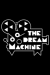
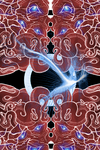
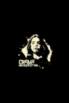
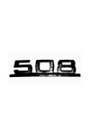
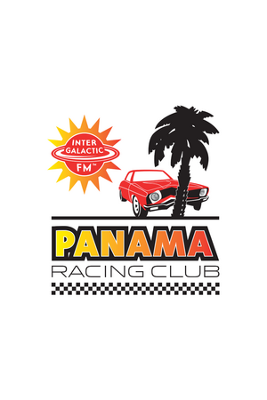
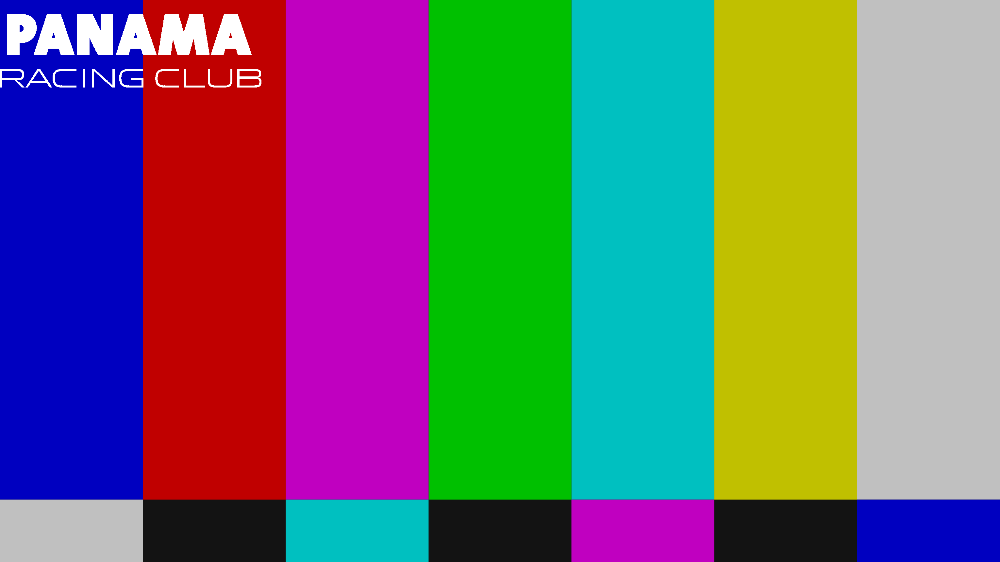
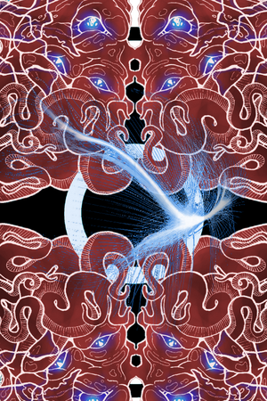
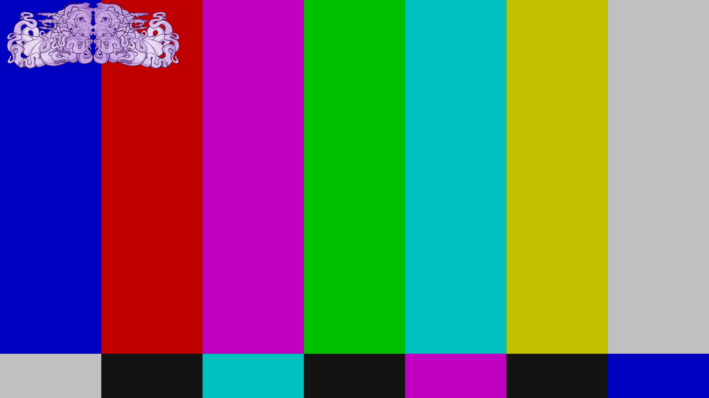
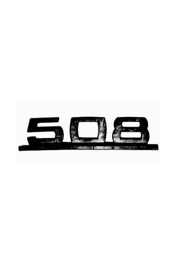
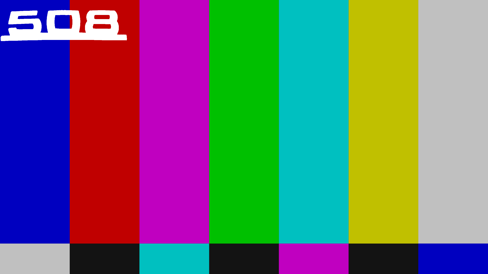

# Intergalactic FM streams for Kodi video plugin

Below are the specific texts and images required by Kodi. Please, try to meet the requirements as close as possible. Kodi has many different views and we do not know which view for navigating and playing streams is used by the user. So using this format as described by Kodi itself gives the best result for all. Let is know when something needs to be changed. This overview has been automatically generated on 2022-03-11 18:13:29.

**Pleas note:** that the examples below with a **clearlogo** are **only** shown in Kodi when you hit pause. The clearlogo is not shown during normal playback. So a stream can still sport its own logos whereever on the screen they want.

## CBS TV

**Tagline** (two to five words): *Nothing Beyond Our Reach*

**Plot** (twenty to thirty words): *Cybernetic Broadcasting System dominates 24/7 our galaxy for over a decade. This stream is non-commercial, non-conventional and nothing like it can be encountered on any planet. You can run all you want, but there is no escaping CBS TV.*

**Genre** (one to three genres): *electro, acid, italo, disco*

**ID and basename**: `cbstv` and `cbs_tv`

**Poster** (1000 x 1500 PNG, main logo in center):

**Fanart** (1920 x 1080 JPG, only for background, max. quality 96, prefer 90):

**Clear logo** (800 x 310 PNG with transparency):

## The Dream Machine TV

**Tagline** (two to five words): *You Are Not Alone*

**Plot** (twenty to thirty words): *This stream is Intergalactic FM's video channel called The Dream Machine for soundtracks, ambient and experimental music.*

**Genre** (one to three genres): *ambient, experimental, soundtracks*

**ID and basename**: `tdmtv` and `the_dream_machine_tv`

**Poster** (1000 x 1500 PNG, main logo in center):

**Fanart** (1920 x 1080 JPG, only for background, max. quality 96, prefer 90):

**Clear logo** (800 x 310 PNG with transparency):

## Panama Racing TV

**Tagline** (two to five words): *We Are Your Friends*

**Plot** (twenty to thirty words): *This stream is Intergalactic FM's video channel called Panama Racing TV and brings the Panama Racing Club to you, or you to the club.*

**Genre** (one to three genres): *electro, acid, italo, disco*

**ID and basename**: `prc` and `panama_racing_tv`

**Poster** (1000 x 1500 PNG, main logo in center):

**Fanart** (1920 x 1080 JPG, only for background, max. quality 96, prefer 90):

**Clear logo** (800 x 310 PNG with transparency):

## Murder Capital TV

**Tagline** (two to five words): *No Station Such Dedication*

**Plot** (twenty to thirty words): *This stream is Murder Capital's TV channel. Delivering a mix of live recordings from the Panama Racing Club, the best B movies and keeping you updated on UFO sightings. This is the apex of dangerous television.*

**Genre** (one to three genres): *electro, acid, italo, B movies*

**ID and basename**: `mtv` and `intergalactic_tv`

**Poster** (1000 x 1500 PNG, main logo in center):

**Fanart** (1920 x 1080 JPG, only for background, max. quality 96, prefer 90):

**Clear logo** (800 x 310 PNG with transparency):

## Magic Waves

**Tagline** (two to five words): *Do you believe in Magic?*

**Plot** (twenty to thirty words): *Hailing from the UK, Magic Waves has been broadcasting since 2006. Known for underground music in their legendary regular Sunday night broadcasts, our team brings you music and culture from the future and past with the highest passion.*

**Genre** (one to three genres): *future past*

**ID and basename**: `mw` and `magic_waves`

**Poster** (1000 x 1500 PNG, main logo in center):

**Fanart** (1920 x 1080 JPG, only for background, max. quality 96, prefer 90):

**Clear logo** (800 x 310 PNG with transparency):

## Laniakea

**Tagline** (two to five words): *In the sunken city of R'lyeh, something is stirring*

**Plot** (twenty to thirty words): *Ph'nglui mglw'nafh Cthulhu R'lyeh wgah'nagl fhtagn.*

**Genre** (one to three genres): *electronic, techno, disco, house*

**ID and basename**: `laniakea` and `laniakea`

**Poster** (1000 x 1500 PNG, main logo in center):

**Fanart** (1920 x 1080 JPG, only for background, max. quality 96, prefer 90):

**Clear logo** (800 x 310 PNG with transparency):

## Neon

**Tagline** (two to five words): *Dreams of Neon, Berlin*

**Plot** (twenty to thirty words): *Dreams of Neon transmits from Berlin offering streams from Neon studios and club nights by Lazercat, Naks and the Dreams of Neon residents.*

**Genre** (one to three genres): *electro, acid, italo*

**ID and basename**: `neon` and `neon`

**Poster** (1000 x 1500 PNG, main logo in center):

**Fanart** (1920 x 1080 JPG, only for background, max. quality 96, prefer 90):

**Clear logo** (800 x 310 PNG with transparency):

## Discotto

**Tagline** (two to five words): *D on the TV*

**Plot** (twenty to thirty words): *Streaming live and direct from the Woolwich triangle, London. Aural and visual stimulation from the studio featuring Discotto and guests.*

**Genre** (one to three genres): *italo, disco, electro*

**ID and basename**: `discotto` and `discotto`

**Poster** (1000 x 1500 PNG, main logo in center):

**Fanart** (1920 x 1080 JPG, only for background, max. quality 96, prefer 90):

**Clear logo** (800 x 310 PNG with transparency):

## El Camino

**Tagline** (two to five words): *Es el Camino*

**Plot** (twenty to thirty words): *Miqkael has been a DJ since 1997 and lived in Barcelona from 2000 until 2011, playing at Moog and other clubs. Since that time he has been also performing around Europe. Streaming from his Basque homeland, he shows you the way by mixing love and anger.*

**Genre** (one to three genres): *techno, disco, chicago, electro*

**ID and basename**: `elcamino` and `elcamino`

**Poster** (1000 x 1500 PNG, main logo in center):

**Fanart** (1920 x 1080 JPG, only for background, max. quality 96, prefer 90):

**Clear logo** (800 x 310 PNG with transparency):

## Shipwrec

**Tagline** (two to five words): *Shipwreced*

**Plot** (twenty to thirty words): *Shipwrec Radio is a Nijmegen-based label which focuses on acid, electro, house and techno, with excursions into braindance, ambient and IDM. Featuring DJ Shipwrec, Camiel, Yash and sometimes guest DJs.*

**Genre** (one to three genres): *electronic music*

**ID and basename**: `shipwrec` and `shipwrec`

**Poster** (1000 x 1500 PNG, main logo in center):

**Fanart** (1920 x 1080 JPG, only for background, max. quality 96, prefer 90):

**Clear logo** (800 x 310 PNG with transparency):

## Onderwereld

**Tagline** (two to five words): *electronic music*

**Plot** (twenty to thirty words): *Platform for all kinds of unique electronic music. Onderwereld is streaming from their bunker somewhere in the Hague.*

**Genre** (one to three genres): *electronic music*

**ID and basename**: `onderwereld` and `onderwereld`

**Poster** (1000 x 1500 PNG, main logo in center):

**Fanart** (1920 x 1080 JPG, only for background, max. quality 96, prefer 90):

**Clear logo** (800 x 310 PNG with transparency):

## Mule Driver

**Tagline** (two to five words): *Mule driving is not a crime*

**Plot** (twenty to thirty words): *Live stream from Mule Driver's machine room*

**Genre** (one to three genres): *electro, acid, techno*

**ID and basename**: `muledriver` and `muledriver`

**Poster** (1000 x 1500 PNG, main logo in center):

**Fanart** (1920 x 1080 JPG, only for background, max. quality 96, prefer 90):

**Clear logo** (800 x 310 PNG with transparency):

## Leftover

**Tagline** (two to five words): *Straight from the bin*

**Plot** (twenty to thirty words): *Taking from all corners of the underground, Leftover Radio brings weekly broadcasts from DIY communities and free spaces. Personal selections and experimental live-sets are transmitted over makeshift connections to a global audience.*

**Genre** (one to three genres): *electro, acid, tekno*

**ID and basename**: `leftover` and `leftover`

**Poster** (1000 x 1500 PNG, main logo in center):

**Fanart** (1920 x 1080 JPG, only for background, max. quality 96, prefer 90):

**Clear logo** (800 x 310 PNG with transparency):

## REVEAL

**Tagline** (two to five words): *Lifting the veil*

**Plot** (twenty to thirty words): *Sometimes you want to go where everybody knows your name and they're always glad you came. You want to be where you can see our troubles are all the same. You want to be where everybody knows your name.*

**Genre** (one to three genres): *electronic music*

**ID and basename**: `reveal` and `reveal`

**Poster** (1000 x 1500 PNG, main logo in center):

**Fanart** (1920 x 1080 JPG, only for background, max. quality 96, prefer 90):

**Clear logo** (800 x 310 PNG with transparency):

## Vunk

**Tagline** (two to five words): *Music from the Heart*

**Plot** (twenty to thirty words): *Music straight from the heart is what David Vunk is all about. Known for his label Moustace Records and his envigorating DJ sets and productions, watch his weekly stream on Wednesday evening from West Coast's Rotterdam.*

**Genre** (one to three genres): *techno, acid, italo, disco*

**ID and basename**: `vunk` and `vunk`

**Poster** (1000 x 1500 PNG, main logo in center):

**Fanart** (1920 x 1080 JPG, only for background, max. quality 96, prefer 90):

**Clear logo** (800 x 310 PNG with transparency):

## Clone

**Tagline** (two to five words): *Serge Clone's stream*

**Plot** (twenty to thirty words): *Serge Clone has a record shop located in Rotterdam, the Netherlands. Next to having a label and begin a distributor focused on electro, techno, house, soundtracks, (italo) disco and much more, he is also an active DJ and producer himself.*

**Genre** (one to three genres): *electronic music*

**ID and basename**: `clone` and `clone`

**Poster** (1000 x 1500 PNG, main logo in center):

**Fanart** (1920 x 1080 JPG, only for background, max. quality 96, prefer 90):

**Clear logo** (800 x 310 PNG with transparency):

## Zahara

**Tagline** (two to five words): *Cocktailbar Scheveningen*

**Plot** (twenty to thirty words): *Live stream from Zahara cocktail bar which is located directly at the beach in Scheveningen, the Netherlands. A frequent location for Intergalactic FM DJs and has hosted for many of the IFM's infamous top 100. The most West you can go on Holland's Coast.*

**Genre** (one to three genres): *electronic music*

**ID and basename**: `zahara` and `zahara`

**Poster** (1000 x 1500 PNG, main logo in center):

**Fanart** (1920 x 1080 JPG, only for background, max. quality 96, prefer 90):

**Clear logo** (800 x 310 PNG with transparency):

## Austin Cassell

**Tagline** (two to five words): *Austin Cassell's stream*

**Plot** (twenty to thirty words): *UK radio host and DJ specialising in braindance, experimental, old school techno and multigenre DJ sets. He has been part of the IFM krew since 2012 curating the very best of new music, classic tracks and exclusive guest sets. Previous guests include Wisp, Global Goon, NEZ, VLR and Impakt*

**Genre** (one to three genres): *braindance, experimental, old school techno*

**ID and basename**: `djaustincassell` and `austin_cassell`

**Poster** (1000 x 1500 PNG, main logo in center):

**Fanart** (1920 x 1080 JPG, only for background, max. quality 96, prefer 90):

**Clear logo** (800 x 310 PNG with transparency):

## Cobra FM

**Tagline** (two to five words): *Live From The Snakepit*

**Plot** (twenty to thirty words): *Brought to you by the Creme Organization, live from the Snakepit Studios in Zagreb, it is Cobra FM.*

**Genre** (one to three genres): *electromic music*

**ID and basename**: `cobrafm` and `cobrafm`

**Poster** (1000 x 1500 PNG, main logo in center):

**Fanart** (1920 x 1080 JPG, only for background, max. quality 96, prefer 90):

**Clear logo** (800 x 310 PNG with transparency):

## 508

**Tagline** (two to five words): *Welcome 2da Club*

**Plot** (twenty to thirty words): *Stream of Club 508. Mix of recordings and live streams of DJ sets and live performances.*

**Genre** (one to three genres): *disco, house, techno, italo, electro, experimental electronics*

**ID and basename**: `508` and `508`

**Poster** (1000 x 1500 PNG, main logo in center):

**Fanart** (1920 x 1080 JPG, only for background, max. quality 96, prefer 90):

**Clear logo** (800 x 310 PNG with transparency):

