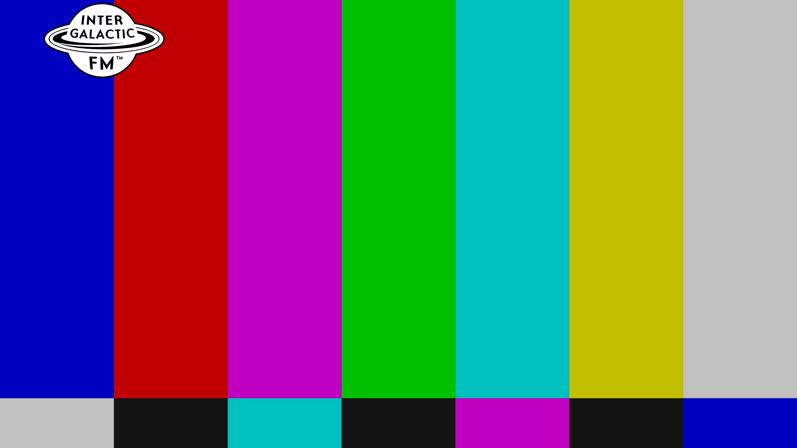

# Intergalactic FM streams for Kodi video plugin

Below are the specific texts and images required by Kodi. Please, try to meet the requirements as close as possible. Kodi has many different views and we do not know which view for navigating and playing streams is used by the user. So using this format as described by Kodi itself gives the best result for all. Let is know when something needs to be changed. This overview has been automatically generated on 2025-05-05 16:55:39.

**Pleas note:** that the examples below with a **clearlogo** are **only** shown in Kodi when you hit pause. The clearlogo is not shown during normal playback. So a stream can still sport its own logos whereever on the screen they want.

## CBS TV

**Tagline** (two to five words): *No Station Such Dedication*

**Plot** (twenty to thirty words): *Cybernetic Broadcasting System dominates 24/7 our galaxy for over a decade. This stream is noncommercial, unconventional and nothing like it can be encountered on any planet. You can run all you want, but there is no escaping CBS TV.*

**Genre** (one to three genres): *electro, acid, italo, disco*

**ID and basename**: `tv` and `cbs_tv`

**Poster** (1000 x 1500 PNG, main logo in center):

**Fanart** (1920 x 1080 JPG, only for background, max. quality 96, prefer 90):

**Clear logo** (800 x 310 PNG with transparency):

## Murder Capital TV

**Tagline** (two to five words): *A New Low In Entertainment!*

**Plot** (twenty to thirty words): *This stream is Murder Capital's TV channel. Delivering a mix of smut and exploitation B movies.*

**Genre** (one to three genres): *B movies, smut, exploitation*

**ID and basename**: `mtv` and `intergalactic_tv`

**Poster** (1000 x 1500 PNG, main logo in center):

**Fanart** (1920 x 1080 JPG, only for background, max. quality 96, prefer 90):

**Clear logo** (800 x 310 PNG with transparency):

## Panama Racing TV

**Tagline** (two to five words): *Where The Meat Meets The Beat*

**Plot** (twenty to thirty words): *Lots of our own ninjas recorded at the Panama Racing Club and other places.*

**Genre** (one to three genres): *electro, acid, italo, disco*

**ID and basename**: `prctv` and `panama_racing_tv`

**Poster** (1000 x 1500 PNG, main logo in center):

**Fanart** (1920 x 1080 JPG, only for background, max. quality 96, prefer 90):

**Clear logo** (800 x 310 PNG with transparency):

## Neon

**Tagline** (two to five words): *Dreams of Neon, Berlin*

**Plot** (twenty to thirty words): *Dreams of Neon transmits from Berlin offering streams from Neon studios and club nights by Lazercat, Naks and the Dreams of Neon residents.*

**Genre** (one to three genres): *electro, acid, italo*

**ID and basename**: `neon` and `neon`

**Poster** (1000 x 1500 PNG, main logo in center):

**Fanart** (1920 x 1080 JPG, only for background, max. quality 96, prefer 90):

**Clear logo** (800 x 310 PNG with transparency):

## Audiodrome

**Tagline** (two to five words): *TODO*

**Plot** (twenty to thirty words): *Seattle's Sonic Playground Awaits: Tune in to Audiodrome at the Pony Club!*

**Genre** (one to three genres): *TODO*

**ID and basename**: `audiodrome` and `audiodrome`

**Poster** (1000 x 1500 PNG, main logo in center):

**Fanart** (1920 x 1080 JPG, only for background, max. quality 96, prefer 90):

**Clear logo** (800 x 310 PNG with transparency):

## Austin Cassell

**Tagline** (two to five words): *Austin Cassell's stream*

**Plot** (twenty to thirty words): *UK radio host and DJ specialising in braindance, experimental, old school techno and multigenre DJ sets. He has been part of the IFM krew since 2012 curating the very best of new music, classic tracks and exclusive guest sets. Previous guests include Wisp, Global Goon, NEZ, VLR and Impakt*

**Genre** (one to three genres): *braindance, experimental, old school techno*

**ID and basename**: `austincassell` and `austin_cassell`

**Poster** (1000 x 1500 PNG, main logo in center):

**Fanart** (1920 x 1080 JPG, only for background, max. quality 96, prefer 90):

**Clear logo** (800 x 310 PNG with transparency):

## El Camino

**Tagline** (two to five words): *Es el Camino*

**Plot** (twenty to thirty words): *Miqkael has been a DJ since 1997 and lived in Barcelona from 2000 until 2011, playing at Moog and other clubs. Since that time he has been also performing around Europe. Streaming from his Basque homeland, he shows you the way by mixing love and anger.*

**Genre** (one to three genres): *techno, disco, chicago, electro*

**ID and basename**: `elcamino` and `elcamino`

**Poster** (1000 x 1500 PNG, main logo in center):

**Fanart** (1920 x 1080 JPG, only for background, max. quality 96, prefer 90):

**Clear logo** (800 x 310 PNG with transparency):

## Hintergarten

**Tagline** (two to five words): *TODO*

**Plot** (twenty to thirty words): *TODO.*

**Genre** (one to three genres): *TODO*

**ID and basename**: `hintergarten` and `hintergarten`

**Poster** (1000 x 1500 PNG, main logo in center):

**Fanart** (1920 x 1080 JPG, only for background, max. quality 96, prefer 90):

**Clear logo** (800 x 310 PNG with transparency):

## Laniakea

**Tagline** (two to five words): *In the sunken city of R'lyeh, something is stirring*

**Plot** (twenty to thirty words): *Ph'nglui mglw'nafh Cthulhu R'lyeh wgah'nagl fhtagn.*

**Genre** (one to three genres): *electronic, techno, disco, house*

**ID and basename**: `laniakea` and `laniakea`

**Poster** (1000 x 1500 PNG, main logo in center):

**Fanart** (1920 x 1080 JPG, only for background, max. quality 96, prefer 90):

**Clear logo** (800 x 310 PNG with transparency):

## Magic Waves

**Tagline** (two to five words): *Do you believe in Magic?*

**Plot** (twenty to thirty words): *Hailing from the UK, Magic Waves has been broadcasting since 2006. Known for underground music in their legendary regular Sunday night broadcasts, our team brings you music and culture from the future and past with the highest passion.*

**Genre** (one to three genres): *future past*

**ID and basename**: `mw` and `magic_waves`

**Poster** (1000 x 1500 PNG, main logo in center):

**Fanart** (1920 x 1080 JPG, only for background, max. quality 96, prefer 90):

**Clear logo** (800 x 310 PNG with transparency):

## Murder Capital TV 2

**Tagline** (two to five words): *Another New Low In Entertainment!*

**Plot** (twenty to thirty words): *This stream is Murder Capital's TV second channel. Delivering a mix of smut and exploitation B movies.*

**Genre** (one to three genres): *B movies, smut, exploitation*

**ID and basename**: `mtv2` and `murder_capital_tv_2`

**Poster** (1000 x 1500 PNG, main logo in center):

**Fanart** (1920 x 1080 JPG, only for background, max. quality 96, prefer 90):

**Clear logo** (800 x 310 PNG with transparency):

## Pinkman

**Tagline** (two to five words): *TODO*

**Plot** (twenty to thirty words): *TODO.*

**Genre** (one to three genres): *TODO*

**ID and basename**: `pinkman` and `pinkman`

**Poster** (1000 x 1500 PNG, main logo in center):

**Fanart** (1920 x 1080 JPG, only for background, max. quality 96, prefer 90):

**Clear logo** (800 x 310 PNG with transparency):

## REVEAL

**Tagline** (two to five words): *Lifting the veil*

**Plot** (twenty to thirty words): *Official Intergalactic FM chapter in Utrecht. REVEAL is a streaming club for DJ sets, live performances and artists in residence.*

**Genre** (one to three genres): *electronic music*

**ID and basename**: `reveal` and `reveal`

**Poster** (1000 x 1500 PNG, main logo in center):

**Fanart** (1920 x 1080 JPG, only for background, max. quality 96, prefer 90):

**Clear logo** (800 x 310 PNG with transparency):

## THE LOW END

**Tagline** (two to five words): *TODO*

**Plot** (twenty to thirty words): *TODO.*

**Genre** (one to three genres): *TODO*

**ID and basename**: `the-low-end` and `the_low_end`

**Poster** (1000 x 1500 PNG, main logo in center):

**Fanart** (1920 x 1080 JPG, only for background, max. quality 96, prefer 90):

**Clear logo** (800 x 310 PNG with transparency):

## Tunnelradio

**Tagline** (two to five words): *TODO*

**Plot** (twenty to thirty words): *TODO.*

**Genre** (one to three genres): *TODO*

**ID and basename**: `tunnelradio` and `tunnelradio`

**Poster** (1000 x 1500 PNG, main logo in center):

**Fanart** (1920 x 1080 JPG, only for background, max. quality 96, prefer 90):

**Clear logo** (800 x 310 PNG with transparency):

## Vinyard

**Tagline** (two to five words): *Music from the yard*

**Plot** (twenty to thirty words): *The pitch black back yard studio somewhere in the northern part of Rotterdam.*

**Genre** (one to three genres): *electronic music*

**ID and basename**: `vinyard` and `vinyard`

**Poster** (1000 x 1500 PNG, main logo in center):

**Fanart** (1920 x 1080 JPG, only for background, max. quality 96, prefer 90):

**Clear logo** (800 x 310 PNG with transparency):

## Radio Nul

**Tagline** (two to five words): *Cult, niche and do it yourself*

**Plot** (twenty to thirty words): *Radio Nul is a collaboration of various radio makers. Emphasis on cult, niche and do it yourself attitude. Radio programs and regular shows with different styles and approaches.*

**Genre** (one to three genres): *electronic music*

**ID and basename**: `radionul` and `radio_nul`

**Poster** (1000 x 1500 PNG, main logo in center):

**Fanart** (1920 x 1080 JPG, only for background, max. quality 96, prefer 90):

**Clear logo** (800 x 310 PNG with transparency):

## Discotto

**Tagline** (two to five words): *D on the TV*

**Plot** (twenty to thirty words): *Streaming live and direct from the Woolwich triangle, London. Aural and visual stimulation from the studio featuring Discotto and guests.*

**Genre** (one to three genres): *italo, disco, electro*

**ID and basename**: `discotto` and `discotto`

**Poster** (1000 x 1500 PNG, main logo in center):

**Fanart** (1920 x 1080 JPG, only for background, max. quality 96, prefer 90):

**Clear logo** (800 x 310 PNG with transparency):

## Shipwrec

**Tagline** (two to five words): *Shipwreced*

**Plot** (twenty to thirty words): *Shipwrec Radio is a Nijmegen-based label which focuses on acid, electro, house and techno, with excursions into braindance, ambient and IDM. Featuring DJ Shipwrec, Camiel, Yash and sometimes guest DJs.*

**Genre** (one to three genres): *electronic music*

**ID and basename**: `shipwrec` and `shipwrec`

**Poster** (1000 x 1500 PNG, main logo in center):

**Fanart** (1920 x 1080 JPG, only for background, max. quality 96, prefer 90):

**Clear logo** (800 x 310 PNG with transparency):

## Mule Driver

**Tagline** (two to five words): *Mule driving is not a crime*

**Plot** (twenty to thirty words): *Live stream from Mule Driver's machine room*

**Genre** (one to three genres): *electro, acid, techno*

**ID and basename**: `muledriver` and `muledriver`

**Poster** (1000 x 1500 PNG, main logo in center):

**Fanart** (1920 x 1080 JPG, only for background, max. quality 96, prefer 90):

**Clear logo** (800 x 310 PNG with transparency):

