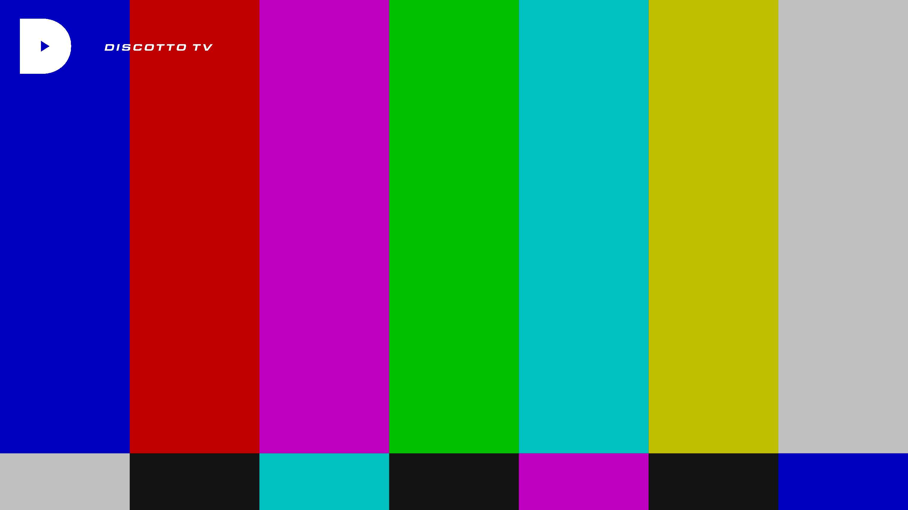

# Intergalactic FM streams for Kodi plugin

# CBS TV

**Tagline** *Nothing Beyond Our Reach*

**Plot** *Cybernetic Broadcasting System dominates 24/7 our galaxy for over a decade. This stream is non-commercial, non-conventional and nothing like it can be encountered on any planet. You can run all you want, but there is no escaping CBS TV.*

**Genre** *electro, acid, italo, disco*

**Background** (only shown behind menu)

**Logo** (only shown when pauzing stream)

# Murder Capital TV

**Tagline** *No Station Such Dedication*

**Plot** *This stream is Murder Capital's TV channel. Delivering a mix of live recordings from the Panama Racing Club, the best B movies and keeping you updated on UFO sighings. This is the apex of the West Coast Sound of Holland.*

**Genre** *electro, acid, italo, B movies*

**Background** (only shown behind menu)

**Logo** (only shown when pauzing stream)

# Magic Waves

**Tagline** *Do you believe in Magic?*

**Plot** *Hailing from the UK, Magic Waves has been broadcasting since 2006. Known for underground music in their legendary regular Sunday night broadcasts, our team brings you music and culture from the future and past with the highest passion.*

**Genre** *Future Past*

**Background** (only shown behind menu)

**Logo** (only shown when pauzing stream)

# Neon

**Tagline** *Dreams of Neon, Berlin*

**Plot** *Dreams of Neon transmits from Berlin offering streams from Neon studios and club nights by Lazercat, Naks and the Dreams of Neon residents.*

**Genre** *electro, acid, italo*

**Background** (only shown behind menu)

**Logo** (only shown when pauzing stream)

# Submit

**Tagline** *Gesloten Cirkel's stream*

**Plot** *Stream from the producer named Gesloten Cirkel. Submit to his stream with his music and visuals.*

**Genre** *electro, acid, techno*

**Background** (only shown behind menu)

**Logo** (only shown when pauzing stream)

# Discotto

**Tagline** *D on the TV*

**Plot** *Streaming live and direct from the Woolwich triangle, London. Aural and visual stimulation from the studio featuring Discotto and guests.*

**Genre** *italo, disco, electro*

**Background** (only shown behind menu)

**Logo** (only shown when pauzing stream)

# Shipwrec

**Tagline** *Shipwreced*

**Plot** *Shipwrec Radio is a Nijmegen-based label which focuses on acid, electro, house and techno, with excursions into braindance, ambient and IDM. Featuring DJ Shipwrec, Camiel, Yash and sometimes guest DJs.*

**Genre** *electronic music*

**Background** (only shown behind menu)

**Logo** (only shown when pauzing stream)

# Onderwereld

**Tagline** *electronic music*

**Plot** *Platform for all kinds of unique electronic music. Onderwereld is streaming from their bunker somewhere in the Hague.*

**Genre** *electronic music*

**Background** (only shown behind menu)

**Logo** (only shown when pauzing stream)

# Mule Driver

**Tagline** *Mule driving is not a crime*

**Plot** *Live stream from Mule Driver's machine room*

**Genre** *electro, acid, techno*

**Background** (only shown behind menu)

**Logo** (only shown when pauzing stream)

# Colophon

This overview has been automatically generated on 2019-05-26 16:27:12.

