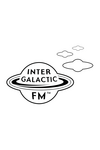
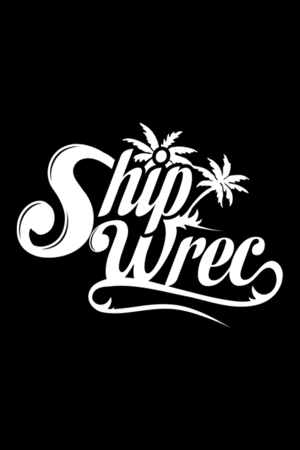

# Intergalactic FM streams for Kodi plugin

This overview has been automatically generated on 2019-05-26 15:48:24.

# CBS TV

**Tagline**: *Nothing Beyond Our Reach*

**Genre**: *electro, acid, italo, disco*

**Plot**: *Cybernetic Broadcasting System dominates our galaxy for over a decade. This stream is non-commercial, non-conventional and nothing like it can be encountered on any planet. You can run all you want, but there is no escaping CBS TV.*

**Menu**:

**Background**:

**Logo**:

# Intergalactic TV

**Tagline**: *No Station Such Dedication*

**Genre**: *electro, acid, italo, B movies*

**Plot**: *This stream is Intergalactic FM's TV channel. Delivering a mix of live recordings from the Panama Racing Club, the best B movies and keeping you updated on UFO sighings. This is the apex of the West Coast Sound of Holland.*

**Menu**:

**Background**:

**Logo**:

# Magic Waves

**Tagline**: *Do you believe in Magic?*

**Genre**: *Future Past*

**Plot**: *Hailing from the UK, Magic Waves has been broadcasting since 2006. Known for underground music in their legendary regular Sunday night broadcasts, our team brings you music and culture from the future and past with the highest passion.*

**Menu**:

**Background**:

**Logo**:

# Neon

**Tagline**: *Dreams of Neon, Berlin*

**Genre**: *electro, acid, italo*

**Plot**: *Dreams of Neon transmits from Berlin offering streams from Neon studios and club nights by Lazercat, Naks and the Dreams of Neon residents.*

**Menu**:

**Background**:

**Logo**:

# Vunk

**Tagline**: *Music from the Heart*

**Genre**: *techno, acid, italo, disco*

**Plot**: *Music straight from the heart is what David Vunk is all about. Known for his label Moustace Records and his envigorating dj sets and productions, watch his weekly stream on Wednesday evening from West Coast's Rotterdam.*

**Menu**:

**Background**:

**Logo**:

# Submit

**Tagline**: *Gesloten Cirkel's stream*

**Genre**: *electro, acid, techno*

**Plot**: *Stream from the producer named Gesloten Cirkel. Submit to his stream with his music and visuals.*

**Menu**:

**Background**:

**Logo**:

# Discotto

**Tagline**: *D on the TV*

**Genre**: *italo, disco, electro*

**Plot**: *Streaming live and direct from the Woolwich triangle, London. Aural and visual stimulation from the studio featuring Discotto and guests.*

**Menu**:

**Background**:

**Logo**:

# Shipwrec

**Tagline**: *Shipwreced*

**Genre**: *electronic music*

**Plot**: *Shipwrec Radio is a Nijmegen-based label which focuses on acid, electro, house and techno, with excursions into braindance, ambient and IDM. Featuring DJ Shipwrec, Camiel, Yash and sometimes guest DJs.*

**Menu**:

**Background**:

**Logo**:

# Clone

**Tagline**: *Serge Clone's stream*

**Genre**: *electronic music*

**Plot**: *Serge Clone has a record shop located in Rotterdam, the Netherlands. Next to having a label and begin a distributor focused on electro, techno, house, soundtracks, (italo) disco and much more, he is also an active dj and producer himself.*

**Menu**:

**Background**:

**Logo**:

# Zahara

**Tagline**: *Cocktailbar Scheveningen*

**Genre**: *electronic music*

**Plot**: *Live stream from Zahara cocktail bar which is located directly at the beach in Scheveningen, the Netherlands. A frequent location for Intergalactic FM djs and has hosted for many of the IFM's infamous top 100. The most West you can go on Holland's Coast.*

**Menu**:

**Background**:

**Logo**:

# Onderwereld

**Tagline**: *electronic music*

**Genre**: *electronic music*

**Plot**: *Platform for all kinds of unique electronic music. Onderwereld is streaming from their bunker somewhere in the Hague.*

**Menu**:

**Background**:

**Logo**:

# Mule Driver

**Tagline**: *Mule driving is not a crime*

**Genre**: *electro, acid, techno*

**Plot**: *Live stream from Mule Driver's machine room*

**Menu**:

**Background**:

**Logo**:

