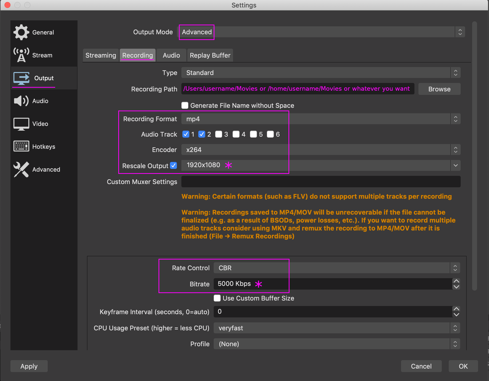
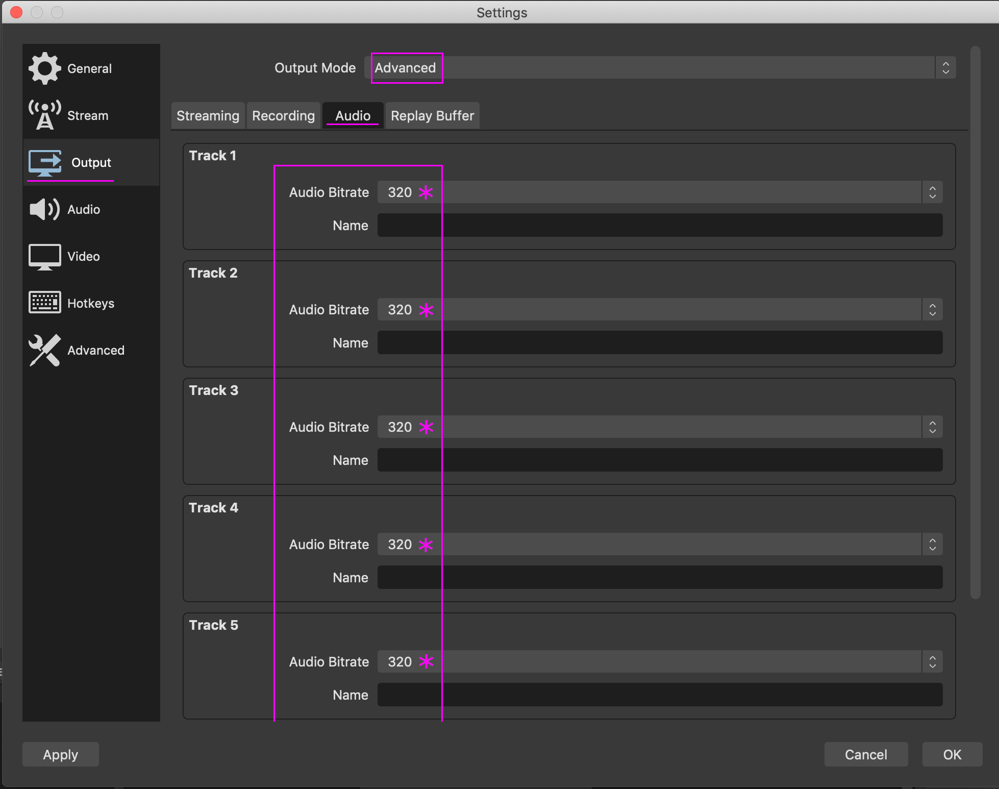

# Instructions for OBS Studio

This document has instructions for making recordings or doing live streaming
with [OBS Studio](https://obsproject.com/). This is free and open source
software which runs on Windows, macOS and Linux.

## 1 Installation

Install the latest version of OBS from their website.

For Linux, use their PPA to get the latest version and automatically keep it up
to date. Many Linux distributions ship OBS, but this is often an older version.

## 2 Recording

To make a recording to send in for exclusive broadcasting, make the following
steps.

In `Settings / Output` choose `Advanced` for `Output Mode`.

### 2.1 Output Recording

Then, in the `Recoding` tab, set the recording path to what you prefer.
Essential is to make the settings:
1. Set the `Recording Format` to `mp4` and enable the audio tracks you use.
2. Set `Encoder` to `x264` and for `Rescale Output` choose `1920x1080`. *
3. For `Rate Control` choose `CBR` (probably already set to that).
4. Below that, set a `Bitrate` of `5000 Kpbs`. *

### 2.2 Output Audio

In the `Audio` tab:
1. Set for all tracks the `Audio Bitrate` to `320`. *

### 2.3 Alternative settings *

In case your device cannot cope with these settings, make **all** of the
following changes to the settings indicated with an *:

Under Recording:
* set `Rescale Output` to `1280x720`
* set `Bitrate` to `3000 Kpbs`

Under Audio:
* set `Audio Bitrate` to `192`

### 2.4 Recording, texts, logos, etc.

Record **without** any logos or text in the video! Also, do not make
announcements in the audio.

A recording should be minimally 30 minutes and maximum 60 minutes long. Good to
do some proper testing before doing a recording. Close other applications and
mute notification sounds from your device. View your recording before sending it
in to double check all went OK.

If you have, for example, two artists recording directly after each other at the
same location, make two separate recordings from it please.

Provide the following text the accompanying message when sending in a recording:
* artist name, in proper upper and lower case characters and spaces where needed
because we don't want to guess the correct spelling
* English name of the city and country where the recording was made
* date when the recording was made, if possible also the start time
* optionally a relevant artist URL

If desired, also send in a logo as a PNG or PDF file. Use a transparent
background when needed.

**IMPORTANT:** When you send in any recording, you agree with exclusive
broadcasting rights until two weeks after the first broadcast. Then your
recording will be added to our online archive. From then on, you can share it
all you want. Do not leak or share the recording before that. Doing so will
exclude the recording from broadcasting.

If you have any questions, such as personal upload instructions, please contact
us via email or in the chat.

## 3 Streaming

Instructions for live streaming will be added here soon.
