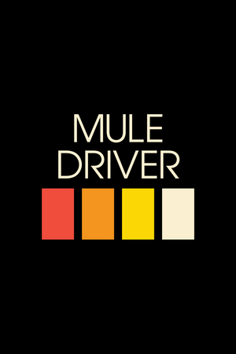
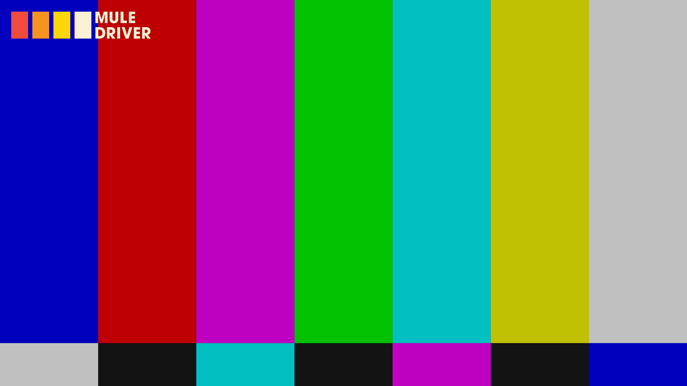

# Intergalactic FM streams for Kodi plugin

Below are the specific texts and images required by Kodi. Please, try to meet the requirements as close as possible. Kodi has many different views and we do not know which view for navigating and playing streams is used by the user. So using this format as described by Kodi itself gives the best result for all. Let is know when something needs to be changed. This overview has been automatically generated on 2019-05-26 16:27:12.

**Pleas note:** that the examples below with a **clearlogo** are **only** shown in Kodi when you hit pause. The clearlogo is not shown during normal playback. So a stream can still sport its own logos whereever on the screen they want.

## CBS TV

**Tagline** (two to five words): *Nothing Beyond Our Reach*

**Plot** (twenty to thirty words): *Cybernetic Broadcasting System dominates 24/7 our galaxy for over a decade. This stream is non-commercial, non-conventional and nothing like it can be encountered on any planet. You can run all you want, but there is no escaping CBS TV.*

**Genre** (one to three genres): *electro, acid, italo, disco*

**ID and basename**: `cbstv` and `cbs_tv`

**Poster** (1000 x 1500 PNG, main logo in center):

**Fanart** (1920 x 1080 JPG, only for background):

**Clear logo** (810 x 310 PNG with transparency):

## Murder Capital TV

**Tagline** (two to five words): *No Station Such Dedication*

**Plot** (twenty to thirty words): *This stream is Murder Capital's TV channel. Delivering a mix of live recordings from the Panama Racing Club, the best B movies and keeping you updated on UFO sighings. This is the apex of the West Coast Sound of Holland.*

**Genre** (one to three genres): *electro, acid, italo, B movies*

**ID and basename**: `prc` and `intergalactic_tv`

**Poster** (1000 x 1500 PNG, main logo in center):

**Fanart** (1920 x 1080 JPG, only for background):

**Clear logo** (810 x 310 PNG with transparency):

## Magic Waves

**Tagline** (two to five words): *Do you believe in Magic?*

**Plot** (twenty to thirty words): *Hailing from the UK, Magic Waves has been broadcasting since 2006. Known for underground music in their legendary regular Sunday night broadcasts, our team brings you music and culture from the future and past with the highest passion.*

**Genre** (one to three genres): *Future Past*

**ID and basename**: `mw` and `magic_waves`

**Poster** (1000 x 1500 PNG, main logo in center):

**Fanart** (1920 x 1080 JPG, only for background):

**Clear logo** (810 x 310 PNG with transparency):

## Neon

**Tagline** (two to five words): *Dreams of Neon, Berlin*

**Plot** (twenty to thirty words): *Dreams of Neon transmits from Berlin offering streams from Neon studios and club nights by Lazercat, Naks and the Dreams of Neon residents.*

**Genre** (one to three genres): *electro, acid, italo*

**ID and basename**: `neon` and `neon`

**Poster** (1000 x 1500 PNG, main logo in center):

**Fanart** (1920 x 1080 JPG, only for background):

**Clear logo** (810 x 310 PNG with transparency):

## Submit

**Tagline** (two to five words): *Gesloten Cirkel's stream*

**Plot** (twenty to thirty words): *Stream from the producer named Gesloten Cirkel. Submit to his stream with his music and visuals.*

**Genre** (one to three genres): *electro, acid, techno*

**ID and basename**: `submit` and `submit`

**Poster** (1000 x 1500 PNG, main logo in center):

**Fanart** (1920 x 1080 JPG, only for background):

**Clear logo** (810 x 310 PNG with transparency):

## Discotto

**Tagline** (two to five words): *D on the TV*

**Plot** (twenty to thirty words): *Streaming live and direct from the Woolwich triangle, London. Aural and visual stimulation from the studio featuring Discotto and guests.*

**Genre** (one to three genres): *italo, disco, electro*

**ID and basename**: `discotto` and `discotto`

**Poster** (1000 x 1500 PNG, main logo in center):

**Fanart** (1920 x 1080 JPG, only for background):

**Clear logo** (810 x 310 PNG with transparency):

## Shipwrec

**Tagline** (two to five words): *Shipwreced*

**Plot** (twenty to thirty words): *Shipwrec Radio is a Nijmegen-based label which focuses on acid, electro, house and techno, with excursions into braindance, ambient and IDM. Featuring DJ Shipwrec, Camiel, Yash and sometimes guest DJs.*

**Genre** (one to three genres): *electronic music*

**ID and basename**: `shipwrec` and `shipwrec`

**Poster** (1000 x 1500 PNG, main logo in center):

**Fanart** (1920 x 1080 JPG, only for background):

**Clear logo** (810 x 310 PNG with transparency):

## Onderwereld

**Tagline** (two to five words): *electronic music*

**Plot** (twenty to thirty words): *Platform for all kinds of unique electronic music. Onderwereld is streaming from their bunker somewhere in the Hague.*

**Genre** (one to three genres): *electronic music*

**ID and basename**: `onderwereld` and `onderwereld`

**Poster** (1000 x 1500 PNG, main logo in center):

**Fanart** (1920 x 1080 JPG, only for background):

**Clear logo** (810 x 310 PNG with transparency):

## Mule Driver

**Tagline** (two to five words): *Mule driving is not a crime*

**Plot** (twenty to thirty words): *Live stream from Mule Driver's machine room*

**Genre** (one to three genres): *electro, acid, techno*

**ID and basename**: `muledriver` and `muledriver`

**Poster** (1000 x 1500 PNG, main logo in center):

**Fanart** (1920 x 1080 JPG, only for background):

**Clear logo** (810 x 310 PNG with transparency):

