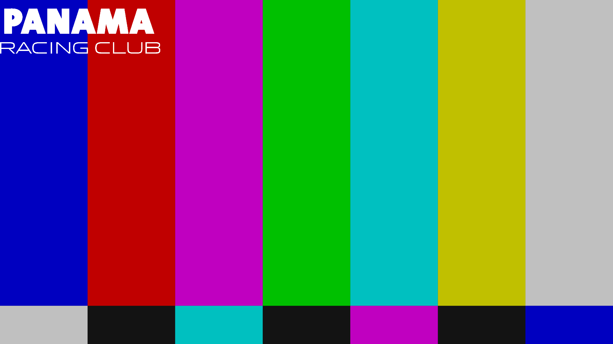
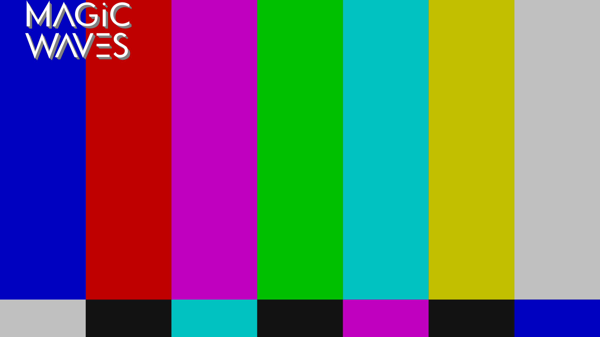
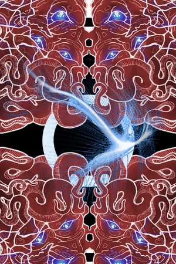
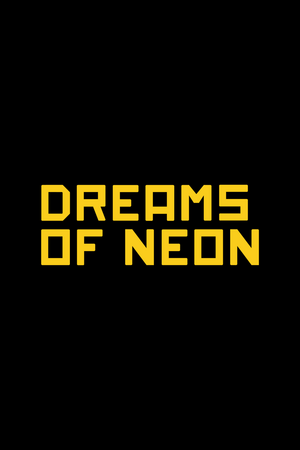
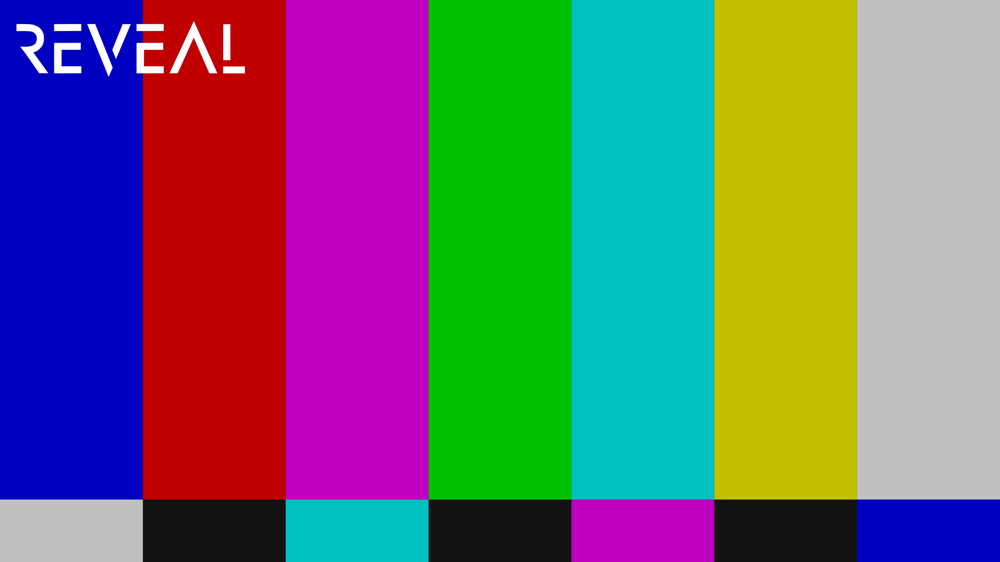

# Intergalactic FM streams for Kodi video plugin

Streams are only available in Kodi if they are live. When they are not live, they are hidden.

# CBS TV

**Tagline** *Nothing Beyond Our Reach*

**Plot** *Cybernetic Broadcasting System dominates 24/7 our galaxy for over a decade. This stream is non-commercial, non-conventional and nothing like it can be encountered on any planet. You can run all you want, but there is no escaping CBS TV.*

**Genre** *electro, acid, italo, disco*

**Background** (only shown behind menu)

**Logo** (only shown when pauzing stream)

# Panama Racing TV

**Tagline** *We Are Your Friends*

**Plot** *This stream is Intergalactic FM's video channel called Panama Racing TV and brings the Panama Racing Club to you, or you to the club.*

**Genre** *electro, acid, italo, disco*

**Background** (only shown behind menu)

**Logo** (only shown when pauzing stream)

# Murder Capital TV

**Tagline** *No Station Such Dedication*

**Plot** *This stream is Murder Capital's TV channel. Delivering a mix of live recordings from the Panama Racing Club, the best B movies and keeping you updated on UFO sightings. This is the apex of dangerous television.*

**Genre** *electro, acid, italo, B movies*

**Background** (only shown behind menu)

**Logo** (only shown when pauzing stream)

# Magic Waves

**Tagline** *Do you believe in Magic?*

**Plot** *Hailing from the UK, Magic Waves has been broadcasting since 2006. Known for underground music in their legendary regular Sunday night broadcasts, our team brings you music and culture from the future and past with the highest passion.*

**Genre** *future past*

**Background** (only shown behind menu)

**Logo** (only shown when pauzing stream)

# Laniakea

**Tagline** *In the sunken city of R'lyeh, something is stirring*

**Plot** *Ph'nglui mglw'nafh Cthulhu R'lyeh wgah'nagl fhtagn.*

**Genre** *electronic, techno, disco, house*

**Background** (only shown behind menu)

**Logo** (only shown when pauzing stream)

# Neon

**Tagline** *Dreams of Neon, Berlin*

**Plot** *Dreams of Neon transmits from Berlin offering streams from Neon studios and club nights by Lazercat, Naks and the Dreams of Neon residents.*

**Genre** *electro, acid, italo*

**Background** (only shown behind menu)

**Logo** (only shown when pauzing stream)

# Discotto

**Tagline** *D on the TV*

**Plot** *Streaming live and direct from the Woolwich triangle, London. Aural and visual stimulation from the studio featuring Discotto and guests.*

**Genre** *italo, disco, electro*

**Background** (only shown behind menu)

**Logo** (only shown when pauzing stream)

# El Camino

**Tagline** *Es el Camino*

**Plot** *Miqkael has been a DJ since 1997 and lived in Barcelona from 2000 until 2011, playing at Moog and other clubs. Since that time he has been also performing around Europe. Streaming from his Basque homeland, he shows you the way by mixing love and anger.*

**Genre** *techno, disco, chicago, electro*

**Background** (only shown behind menu)

**Logo** (only shown when pauzing stream)

# Shipwrec

**Tagline** *Shipwreced*

**Plot** *Shipwrec Radio is a Nijmegen-based label which focuses on acid, electro, house and techno, with excursions into braindance, ambient and IDM. Featuring DJ Shipwrec, Camiel, Yash and sometimes guest DJs.*

**Genre** *electronic music*

**Background** (only shown behind menu)

**Logo** (only shown when pauzing stream)

# Mule Driver

**Tagline** *Mule driving is not a crime*

**Plot** *Live stream from Mule Driver's machine room*

**Genre** *electro, acid, techno*

**Background** (only shown behind menu)

**Logo** (only shown when pauzing stream)

# REVEAL

**Tagline** *Lifting the veil*

**Plot** *Sometimes you want to go where everybody knows your name and they're always glad you came. You want to be where you can see our troubles are all the same. You want to be where everybody knows your name.*

**Genre** *electronic music*

**Background** (only shown behind menu)

**Logo** (only shown when pauzing stream)

# Colophon

The video plugin can be installed directly from within Kodi. For more information, see https://kodi.tv/addon/plugins-video-add-ons/intergalactic-fm-tv

This overview has been automatically generated on 2025-02-21 09:11:09.

