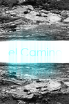
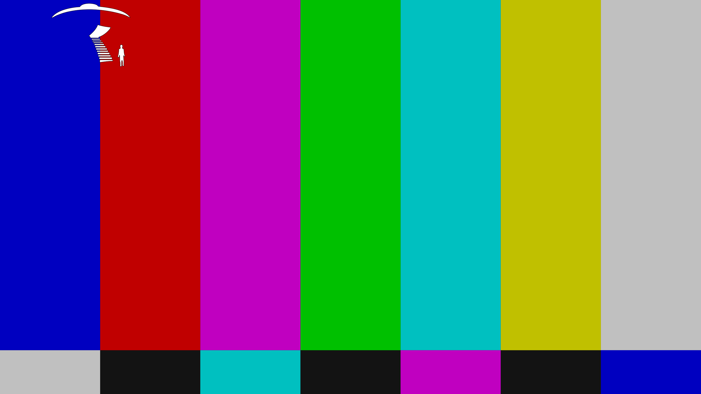
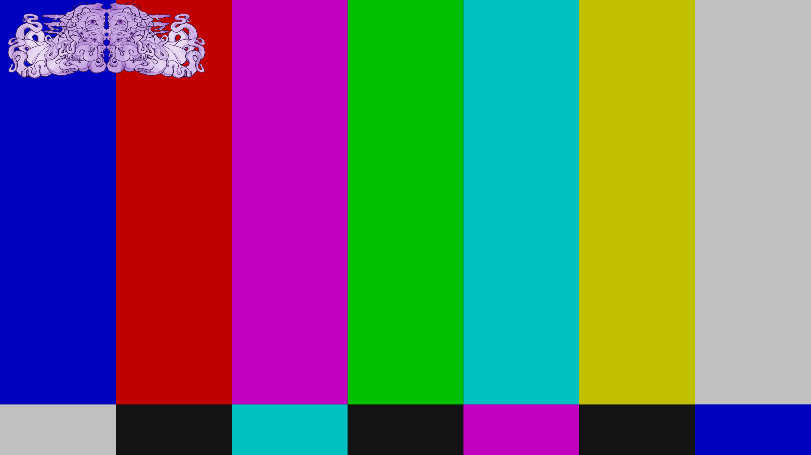
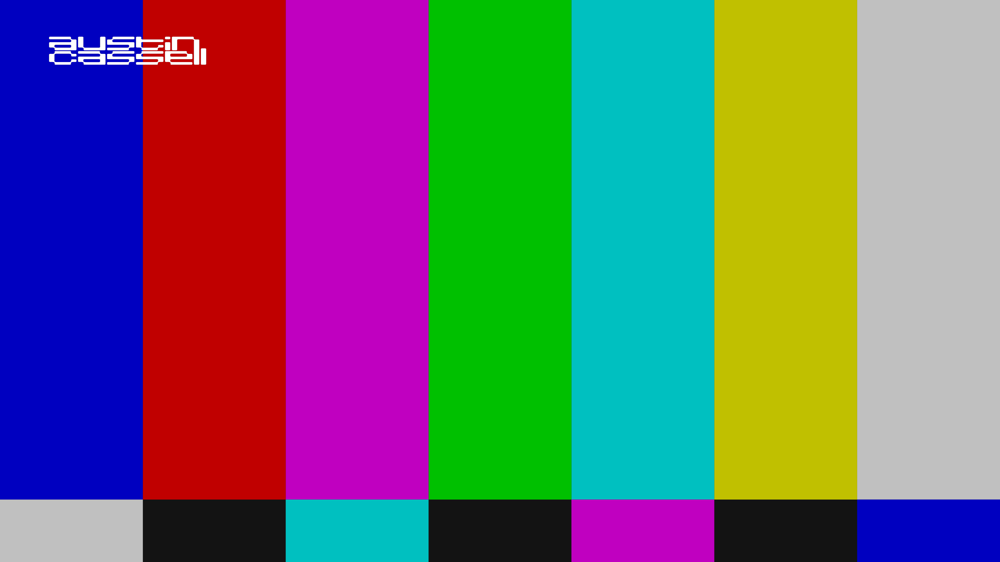

# Intergalactic FM streams for Kodi video plugin

Streams are only available in Kodi if they are live. When they are not live, they are hidden.

# CBS TV

**Tagline** *Nothing Beyond Our Reach*

**Plot** *Cybernetic Broadcasting System dominates 24/7 our galaxy for over a decade. This stream is non-commercial, non-conventional and nothing like it can be encountered on any planet. You can run all you want, but there is no escaping CBS TV.*

**Genre** *electro, acid, italo, disco*

**Background** (only shown behind menu)

**Logo** (only shown when pauzing stream)

# The Dream Machine TV

**Tagline** *You Are Not Alone*

**Plot** *This stream is Intergalactic FM's video channel called The Dream Machine for soundtracks, ambient and experimental music.*

**Genre** *ambient, experimental, soundtracks*

**Background** (only shown behind menu)

**Logo** (only shown when pauzing stream)

# Murder Capital TV

**Tagline** *No Station Such Dedication*

**Plot** *This stream is Murder Capital's TV channel. Delivering a mix of live recordings from the Panama Racing Club, the best B movies and keeping you updated on UFO sightings. This is the apex of dangerous television.*

**Genre** *electro, acid, italo, B movies*

**Background** (only shown behind menu)

**Logo** (only shown when pauzing stream)

# Magic Waves

**Tagline** *Do you believe in Magic?*

**Plot** *Hailing from the UK, Magic Waves has been broadcasting since 2006. Known for underground music in their legendary regular Sunday night broadcasts, our team brings you music and culture from the future and past with the highest passion.*

**Genre** *future past*

**Background** (only shown behind menu)

**Logo** (only shown when pauzing stream)

# Laniakea

**Tagline** *In the sunken city of R'lyeh, something is stirring*

**Plot** *Ph'nglui mglw'nafh Cthulhu R'lyeh wgah'nagl fhtagn.*

**Genre** *electronic, techno, disco, house*

**Background** (only shown behind menu)

**Logo** (only shown when pauzing stream)

# Neon

**Tagline** *Dreams of Neon, Berlin*

**Plot** *Dreams of Neon transmits from Berlin offering streams from Neon studios and club nights by Lazercat, Naks and the Dreams of Neon residents.*

**Genre** *electro, acid, italo*

**Background** (only shown behind menu)

**Logo** (only shown when pauzing stream)

# Discotto

**Tagline** *D on the TV*

**Plot** *Streaming live and direct from the Woolwich triangle, London. Aural and visual stimulation from the studio featuring Discotto and guests.*

**Genre** *italo, disco, electro*

**Background** (only shown behind menu)

**Logo** (only shown when pauzing stream)

# El Camino

**Tagline** *Es el Camino*

**Plot** *Miqkael has been a DJ since 1997 and lived in Barcelona from 2000 until 2011, playing at Moog and other clubs. Since that time he has been also performing around Europe. Streaming from his Basque homeland, he shows you the way by mixing love and anger.*

**Genre** *techno, disco, chicago, electro*

**Background** (only shown behind menu)

**Logo** (only shown when pauzing stream)

# Shipwrec

**Tagline** *Shipwreced*

**Plot** *Shipwrec Radio is a Nijmegen-based label which focuses on acid, electro, house and techno, with excursions into braindance, ambient and IDM. Featuring DJ Shipwrec, Camiel, Yash and sometimes guest DJs.*

**Genre** *electronic music*

**Background** (only shown behind menu)

**Logo** (only shown when pauzing stream)

# Onderwereld

**Tagline** *electronic music*

**Plot** *Platform for all kinds of unique electronic music. Onderwereld is streaming from their bunker somewhere in the Hague.*

**Genre** *electronic music*

**Background** (only shown behind menu)

**Logo** (only shown when pauzing stream)

# Mule Driver

**Tagline** *Mule driving is not a crime*

**Plot** *Live stream from Mule Driver's machine room*

**Genre** *electro, acid, techno*

**Background** (only shown behind menu)

**Logo** (only shown when pauzing stream)

# Leftover

**Tagline** *Straight from the bin*

**Plot** *Taking from all corners of the underground, Leftover Radio brings weekly broadcasts from DIY communities and free spaces. Personal selections and experimental live-sets are transmitted over makeshift connections to a global audience.*

**Genre** *electro, acid, tekno*

**Background** (only shown behind menu)

**Logo** (only shown when pauzing stream)

# REVEAL

**Tagline** *Lifting the veil*

**Plot** *Sometimes you want to go where everybody knows your name and they're always glad you came. You want to be where you can see our troubles are all the same. You want to be where everybody knows your name.*

**Genre** *electronic music*

**Background** (only shown behind menu)

**Logo** (only shown when pauzing stream)

# Vunk

**Tagline** *Music from the Heart*

**Plot** *Music straight from the heart is what David Vunk is all about. Known for his label Moustace Records and his envigorating DJ sets and productions, watch his weekly stream on Wednesday evening from West Coast's Rotterdam.*

**Genre** *techno, acid, italo, disco*

**Background** (only shown behind menu)

**Logo** (only shown when pauzing stream)

# Clone

**Tagline** *Serge Clone's stream*

**Plot** *Serge Clone has a record shop located in Rotterdam, the Netherlands. Next to having a label and begin a distributor focused on electro, techno, house, soundtracks, (italo) disco and much more, he is also an active DJ and producer himself.*

**Genre** *electronic music*

**Background** (only shown behind menu)

**Logo** (only shown when pauzing stream)

# Zahara

**Tagline** *Cocktailbar Scheveningen*

**Plot** *Live stream from Zahara cocktail bar which is located directly at the beach in Scheveningen, the Netherlands. A frequent location for Intergalactic FM DJs and has hosted for many of the IFM's infamous top 100. The most West you can go on Holland's Coast.*

**Genre** *electronic music*

**Background** (only shown behind menu)

**Logo** (only shown when pauzing stream)

# Austin Cassell

**Tagline** *Austin Cassell's stream*

**Plot** *UK radio host and DJ specialising in braindance, experimental, old school techno and multigenre DJ sets. He has been part of the IFM krew since 2012 curating the very best of new music, classic tracks and exclusive guest sets. Previous guests include Wisp, Global Goon, NEZ, VLR and Impakt*

**Genre** *braindance, experimental, old school techno*

**Background** (only shown behind menu)

**Logo** (only shown when pauzing stream)

# Cobra FM

**Tagline** *Live From The Snakepit*

**Plot** *Brought to you by the Creme Organization, live from the Snakepit Studios in Zagreb, it is Cobra FM.*

**Genre** *electromic music*

**Background** (only shown behind menu)

**Logo** (only shown when pauzing stream)

# 508

**Tagline** *Welcome 2da Club*

**Plot** *Stream of Club 508. Mix of recordings and live streams of DJ sets and live performances.*

**Genre** *disco, house, techno, italo, electro, experimental electronics*

**Background** (only shown behind menu)

**Logo** (only shown when pauzing stream)

# Colophon

The video plugin can be installed directly from within Kodi. For more information, see https://kodi.tv/addon/plugins-video-add-ons/intergalactic-fm-tv

This overview has been automatically generated on 2022-03-01 11:53:40.

